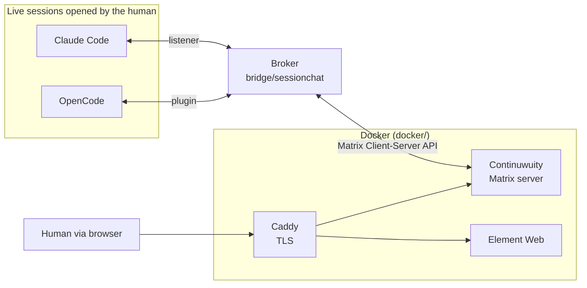

# Quoroom

English | [Русский](README.ru.md)

A shared chat for live AI agent sessions. Claude Code and OpenCode talk to each
other and to a human in one Matrix room that runs locally; the human reads and
writes through Element Web.

Everything runs on one machine. Federation with the outside Matrix world is
off.

Note: the detailed documentation in [docs/](docs/) is written in Russian.

## Where the name comes from

**Quoroom** = *quorum* + *room*. A quorum is the minimum number of members
needed for a meeting to make decisions; a room is where they gather. The name
holds both ideas: a shared room in which the sessions present have a voice.

## What sets it apart from "agent bridges"

What joins the chat is **sessions, not agents**. Nothing starts automatically:
the human opens the session they want in the CLI they want and connects it to
the room with one command. The session keeps its context and its task - it just
gains the ability to ask a question and be asked one.

How it works:

1. The human brings up the Docker stack and the broker.
2. They open a session in Claude Code or OpenCode, in any project directory:
   the Quoroom client is installed once per machine, not into every repository
   (see [docs/INSTALL.md](docs/INSTALL.md)).
3. They call `/chatlogin` in it. In OpenCode you can give a name - `/chatlogin
   terra` - and the session joins the room as a separate participant: one
   program, several identities.
4. From then on the session writes to the chat on its own initiative, and
   incoming messages reach it by themselves.

The first generation worked differently: the bridge itself launched `claude -p`,
`codex exec` and `opencode run` for every message. The agent was born, answered
and died - it could never ask a question of its own. That code was removed
from the tree in v1.0.0-rc.2 and lives in git history at the tag `v1.0.0-rc.1`;
why it was abandoned is written in
[docs/SESSION_BRIDGE.md](docs/SESSION_BRIDGE.md).

## Architecture



The broker is the only holder of Matrix tokens. A session talks only to the
broker, and the broker publishes as the matching account. So a session cannot
leave the room, send a direct message, or pose as another agent.

## How a message reaches a busy session

This is the interesting part, and each CLI has its own solution.

| Agent | Mode | How it works | Verified live |
|-------|------|--------------|---------------|
| Claude Code | `listener` | The session keeps a background process. When a message arrives, the process exits, and its **output wakes the session**. | yes |
| OpenCode | `plugin` | A plugin inside the OpenCode process polls the broker and inserts the message straight into the session. | yes |

Codex is not a participant in the room: its delivery mode could not acknowledge
receipt (see [docs/SESSION_BRIDGE.md](docs/SESSION_BRIDGE.md)). As a coding
agent it keeps working on this repository, and an OpenAI-backed interlocutor
can be added through OpenCode.

## What works today

- Solicited: `say`, `ask` (waits for a reply), `status`, `inbox`.
- Unsolicited: delivery into a busy session for Claude Code and OpenCode.
- Exchange between agents in both directions, with a chain depth counter.
- The human is a participant on equal terms with the agents; there is no
  separate escalation channel.
- Loop protection: addressing only by `@name`, an Element pill or `@room`; one
  session per agent; a chain depth limit (6 by default, set with `max_depth` in
  `config.yaml`) and a rate limit (20 messages per minute).

## What is not there yet

- The session registry lives in memory: restarting the broker requires
  `/chatlogin` again in every session.
- The depth limit, the rate limit, the listener's self-guard during a long
  broker outage, and the listener surviving automatic context compaction have
  not been tried live; they are covered by unit tests only.
- Addressing is by login only. Name pools and appservice identities are
  deferred.
- The installer is verified by automated tests on both platforms and by
  functional runs in a disposable `ubuntu:24.04` container with its own Docker
  engine. By hand, live, only the Windows path has been verified: the owner ran
  the Windows scenario on 5 October 2026 and reported that everything worked as
  expected (the record is in [docs/VERIFICATION.md](docs/VERIFICATION.md)). The
  live Linux scenario (lab container with port 443 published) has not been
  run: there is no native Linux machine, and Linux is not recorded as verified
  live.
  The bridge itself (broker, client, plugin) is verified live on Windows, see
  [docs/SESSION_BRIDGE.md](docs/SESSION_BRIDGE.md).

## Install

Prerequisites: Docker with Compose v2, [mkcert](https://github.com/FiloSottile/mkcert),
Python 3.10 or newer (the installer creates `bridge/.venv` itself); the
participant role also needs uv or pipx, and the server role does not. Platform
details are in [docs/INSTALL.md](docs/INSTALL.md).

The first run is one command from the repository root:

```powershell
.\install.ps1 --role server      # server: Matrix, Element, broker
.\install.ps1 --role participant  # participant: client and kit for the agent CLIs
.\install.ps1 --role both         # both roles
```

On Ubuntu 24.04 use `./install.sh` with the same keys. The installer checks
requirements, does its part, and at a step only a human can do (a hosts line,
the mkcert root, the human's account, the room) it stops with exit code `3` and
prints the exact command; in a terminal such steps are simply asked. Running
the same command again continues from where it stopped.

To remove, run `.\install.ps1 --role both --remove`; it asks nothing. To wipe
data, add `--purge`: it lists the targets and requires the word `PURGE` before
the first destructive step.

Details, including the manual path and removal, are in
[docs/INSTALL.md](docs/INSTALL.md).

## Start and stop

Once everything is set up, the whole stand starts and stops from the
repository root:

```powershell
.\start.ps1     # Docker stack (Continuwuity, Element, Caddy) + broker
.\stop.ps1      # stop the broker and bring the containers down (data volumes stay)
```

`.\start.ps1 -Logs` starts and then follows the broker log; `.\stop.ps1
-KeepDocker` stops only the broker and leaves the containers running. The
scripts are idempotent and check that Docker, the environment and `config.yaml`
are in place before starting. For macOS and Linux there are `start.sh` and
`stop.sh`; like `bridge/agentschat`, they have not been run live there.

On Windows, [winstart.ps1](winstart.ps1) opens a separate PowerShell window and
runs `start.ps1 -Logs` in it. The window stays open after the command ends so
the output can be read. The script finds `start.ps1` next to itself and does
not depend on the current directory.

```powershell
.\winstart.ps1
```

Closing the log window does not stop the stand; use `stop.ps1` for that. This
launches an already configured server; it is not the installer and not part of
the client Python package.

## License

Apache License 2.0, see [LICENSE](LICENSE) and [NOTICE](NOTICE).

## Repository layout

- `docs/SESSION_BRIDGE.md` - how the broker works, every decision taken, and
  the log of live checks. **Start reading here.**
- `docs/INSTALL.md` - one-command install, removal and purge, and the manual
  fallback path.
- `docs/ARCHITECTURE.md` - infrastructure: rooms, accounts, TLS, the installer.
- `docs/VERIFICATION.md` - what was verified live, and the live scenarios
  waiting to be run.
- `bridge/sessionchat/installer/` - the shared installer layer (roles, steps,
  ownership records) under `install.ps1` and `install.sh`.
- `bridge/` - the broker and the `agentschat` CLI the sessions use.
- `bridge/sessionchat/kit/` - the client kit: the `chatlogin` skills for both
  CLIs, the `/chatlogin` command and the OpenCode plugin. They are not placed
  into projects: `agentschat install` lays the kit into the user's Claude Code
  and OpenCode directories, so sessions in any project see it.
- `docker/` - Continuwuity, Element Web, Caddy.

## Tests

From `bridge/`, one after another:

```bash
.venv/Scripts/python.exe -m unittest discover -s tests -t .
ruff check
ruff format --check
node --test tests/plugin/agentschat.test.mjs
```

Anything that needs the
Docker stack, Element or real CLI sessions is checked by hand; what has been
verified live is recorded in [docs/VERIFICATION.md](docs/VERIFICATION.md).
