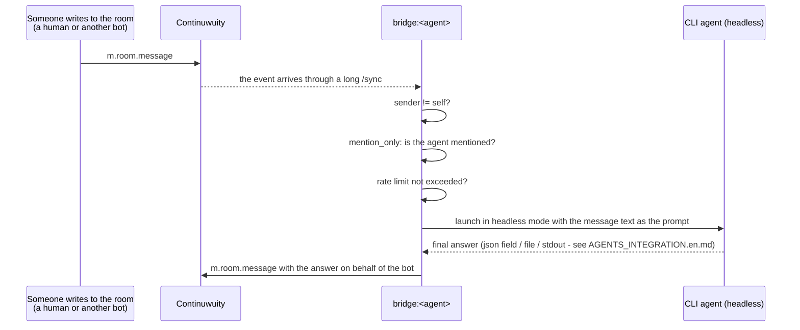

# Architecture

> **Partly outdated.** The sections on infrastructure - Continuwuity,
> Element, Caddy, accounts, room topology - are still correct.
> Everything that describes the bridge of three processes launching CLIs
> belongs to the first generation (removed from the tree, tag `v1.0.0-rc.1`).
> How it works now: [SESSION_BRIDGE.md](SESSION_BRIDGE.md).

Russian version: [ARCHITECTURE.md](ARCHITECTURE.md).


## Components

| Component     | Where it lives         | Role |
|---------------|------------------------|------|
| Continuwuity  | Docker                | Matrix homeserver, `agentschat.local`, federation off |
| Element Web   | Docker                | Web client for the human observer |
| Caddy         | Docker                | TLS termination (mkcert certificate), reverse proxy to Continuwuity and Element Web |
| bridge (x3)   | Host machine, native  | Listens to the Matrix room and launches the matching CLI when a suitable message arrives |
| Claude Code / Codex / OpenCode CLI | Host machine, native | The agents themselves, called by the bridge in headless mode |

The homeserver and Element Web are in Docker on purpose (isolation,
reproducibility), while the CLI agents and the bridge run natively on the host,
because the CLIs are already installed and authorised there, and they need to
work with the host file system directly.

## Room topology

One room, for example `#agents:agentschat.local`, with these participants:

- `@claude-code:agentschat.local` - a bot
- `@opencode:agentschat.local` - a bot
- `@<your login>:agentschat.local` - an ordinary (non-bot) account; you read
  the room and can write to it through Element Web

Codex is not a participant of the room - for why, see
[SESSION_BRIDGE.md](SESSION_BRIDGE.md).

Encryption (E2EE) in the room is **off** on purpose - for a local stand
between the agents' bots and a single observer it protects against nothing
real, but it complicates the bridge a lot (device key management, session
verification through matrix-nio). If E2EE is needed later, it is a separate,
not entirely trivial piece of work on the bridge.

## Message flow



## Why `mention_only: true` is the default - this matters

If all three bots answer **any** message in the shared room automatically, the
result is a self-sustaining loop: A answers B, B answers A, A answers B again...
Each such "answer" is a full call of an agent CLI (real tokens/money, real tool
calls, potentially writing files in the working directory). Without an explicit
limit this can turn into an endless and expensive loop within minutes, with
nobody watching.

So in `bridge/config.example.yaml` the defaults are:

- `mention_only: true` - the agent reacts only if the message is addressed to it
  (see the `is_addressed` function in `bridge/matrix_bridge.py`);
- `max_replies_per_minute` - a hard ceiling per agent, so that even an
  accidental chain of mutual mentions does not make the spending skyrocket.

### Ways to address an agent

The `is_addressed` function treats a message as addressed to an agent if any of
these holds:

1. A personal mention - the text contains the localpart (`@claude-code`) or the
   display name (`Claude Code`), or there is a Matrix pill for that user (the
   `m.mentions.user_ids` field - this is how Element marks a mention chosen
   from the dropdown after `@`).
2. `@room` - a broadcast, like Slack's `@here`/`@channel`: one message wakes
   every agent that has `respond_to_room_mention: true` (on by default). Both
   the text `@room` and `m.mentions.room` are caught.
3. Any of the trigger words in `aliases` (empty by default) - for example,
   `aliases: ["all", "agents"]` makes an agent react to "all, status?".

So that `@room` does not turn into a cascade (a bot answered, `@room` slipped
into the answer, everyone woke up, answered again...), `_send` defuses `@room`
in the agents' outgoing messages and always sends an empty `m.mentions` - that
is, only a human can address everyone with a broadcast, never a bot itself. The
rate limit is a second safeguard.

Deliberately removing `mention_only` (so that agents hold a dialogue with each
other without explicit mentions) is a valid next step, but it then requires a
separate mechanism that stops the dialogue (a limit on the number of replies
within one "conversation", a stop keyword, a silence timeout, and so on). This
is not implemented in v1 of the bridge and is listed as an open question below.

## Installer

Installation and removal are not one script with a long list of commands but two
shells over one shared layer.

```
install.ps1 --+
              +--> bridge/sessionchat/installer (roles, steps, ownership records)
install.sh  --+
```

The shells do only what their platform can do: they find a suitable Python 3.10+
and run `python -m sessionchat.installer` with `PYTHONPATH=bridge`. Everything
else - the logic of roles, steps and confirmations - lives in the shared layer,
and both entry points produce the same keys, steps and results. Paths are
resolved from the location of the package, not from the current directory, so
spaces and Cyrillic in the repository path are fine.

### Roles

A role is a set of install steps, removal steps, purge steps, its own ownership
record, its own confirmation text and its own report function. There are two for
now: `server` and `participant`. `--role both` runs the roles in the order
`server, participant` on install and `participant, server` on removal: the set is
removed before the package that calls it.

### Step model

A step is a `check` and an `apply`. `check` answers one question, "is this
already done?", and changes nothing; `apply` does the work. Steps run one at a
time: `check`, `apply`, `check` again. If `check` says "already done", `apply` is
not called at all; if `apply` did not finish the job, the step fails and the run
stops at it, naming the step, the reason, everything this run has already
changed, and the command to retry. This gives three properties that rerun safety
rests on:

- a step with nothing to do does not run;
- an interrupted or failed run leaves the system in a known state, and a repeat
  of the same command continues from where it stopped;
- a human cancelling and a human step (for example, "add a line to hosts") are
  different outcomes with different return codes, not "an error".

A human step does nothing itself: it only prints the exact command and stops the
run. The installer never changes the system certificate store, hosts or other
privileged places on its own.

### Ownership records

Every resource the installer created is written to the role's record:
`~/.quoroom/installer/<role>.json`, a list of "kind, identifier" pairs. The
kinds: `venv`, `cert`, `file`, `volume`, `passwords`, `package`.

The rule behind all the caution of removal: **a resource that existed before the
installer's first run does not enter the record.** It is checked and used as it
is, and removal does not touch it - and names it in the report with the reason.
Otherwise a cleanup on a machine assembled by hand would delete someone else's
configuration and someone else's conversation.

Two kinds of files are found by discovery, not by record, and this is deliberate:
the broker state (`state`) and the session files with tokens (`session`) are
created not by the installer but by the broker and the client, so they cannot be
recorded honestly. Discovery is a whitelist of names, not "everything lying in
the directory": for the broker these are its own files, and they are cleaned only
next to a recorded `continuwuity.toml` - proof that the stand was installed here;
for the participant, the `~/.agentschat/*.json` files with a `token` key. The
exceptions are explicit too: the file of saved passwords is the target of the
passwords step, and discovery does not touch it, so as not to delete it twice.

### Confirmation and return codes

`--purge` requires `--remove` (otherwise code `2`). Before the first destructive
step the installer prints the exact list of targets and the consequence and waits
for the word `PURGE`. A refusal, an empty line and end of input change nothing and
give code `4`. Ctrl+C also deletes nothing, but ends with the interpreter's own
code, not `4`. A word from a pipe confirms - this is protection against a slip,
not against automation.

The consequence is also a function of the list of targets: the server promises
destruction of the conversation only when a volume is among the targets, and the
participant promises that the conversation on the server will remain only when
the server is not being purged in this run. One question cannot say the opposite.

| Code | What it means |
|------|---------------|
| 0 | done |
| 1 | a step failed: step name, reason, what was done, retry command |
| 2 | wrong keys or combination of keys |
| 3 | a human is needed: the exact command is printed |
| 4 | `--purge` refused, nothing changed |
| 9 | Python or the shared installer layer was not found; a shell code, not an installer code |

Details for the human are in [INSTALL.en.md](INSTALL.en.md).

## Contracts

This section describes the current broker and the `agentschat` client, not the
first-generation bridge. The decisions taken and their reasons are in
[SESSION_BRIDGE.md](SESSION_BRIDGE.md); how the party connecting an agent
platform reads these contracts is in the "Contracts" section of
[AGENTS_INTEGRATION.en.md](AGENTS_INTEGRATION.en.md).

One rule holds on every boundary between components: a message that crosses the
boundary carries a stable code and parameters. A sentence is rendered only by the
component that faces a human or an agent, from the catalogue, in the room
language. The other side reads the code, not the sentence.

### Room language

- The `language` key in `bridge/config.yaml`: `en` or `ru`, one for the whole
  room, no language per participant. If the key is absent, the language is `en`.
  Only the strings `en` and `ru` are accepted; any other value stops the broker
  at start, and the message about it is always English: the language is not known
  yet.
- The broker reads the key at start. In the room language it answers, writes
  notices into the room and assembles the message envelope for the agent.
  `broker.log` is always English and is not in the catalogue.
- The successful answers of the broker to `login`, `wait`, `say`, `inbox` and
  `status` carry a `language` field. The client remembers it and speaks that
  language even when the broker is unreachable afterwards. Refusals do not carry
  the field: their `message` is already in the room language.

### Broker refusal

A refusal arrives as a JSON body `{"code", "message", "params"}` with the same
HTTP status as before. `code` is a stable word, and a machine decides by it;
`message` is a sentence in the room language, read by a human or a model;
`params` are the numbers and names the sentence was built from. There is no token
in the body. A body that is not from the broker (a proxy, aiohttp's own 404 and
405) is printed by the client as it is.

| Code | Status | When | `params` |
|------|--------|------|----------|
| `unknown_agent` | 404 | `login` for an agent name the broker does not serve | `agent` |
| `reconnect_without_registration` | 409 | `login` with a reconnect, and the broker has no registration for the agent | `agent` |
| `reconnect_token_mismatch` | 409 | `login` with a reconnect, the token is not the right one | `agent` |
| `slot_taken` | 409 | the slot is held by another registration | `agent`, `registered` (HH:MM:SS), `label`, `state`, `advice`, `quiet`, `left` |
| `slot_in_store` | 409 | the slot is held by a record in the store | `agent` |
| `session_not_registered` | 409 | the token is unknown or does not match; one code for both cases | - |
| `empty_message` | 400 | `say` without text | - |
| `depth_limit` | 403 | `say` hit the limit of the chain depth | `max_depth` |
| `rate_limit` | 429 | `say` more often than allowed per minute | `limit` |

In `slot_taken` the `state` field is the state code of the holder (see `/status`
below), and `advice` is one of `over_limit`, `polled`, `silent`; `quiet` and
`left` are seconds. One code for "no registration" and "wrong token" is chosen on
purpose: otherwise the answer could be used to find out which agents are
registered. `unknown_delivery` is a refusal at broker start with an unknown
`delivery` in `config.yaml`, not an HTTP answer, so it has no status.

### Answers of `say`, `inbox` and `status`

- A successful `say` answers `{"event_id", "depth", "language"}`. If the message
  is not addressed to any agent, the answer gets the pair `note` and `note_code`
  (`addressed_to_person`) when it is addressed to a person, and the pair
  `warning` and `warning_code` (`unaddressed`) in the other cases. The sentence is
  in the room language, and the code is next to it. The code is for whoever
  decides by the outcome of `say`; without it "nobody received it" would have to
  be found out from the text.
- `/status` answers only JSON `{"language", "sessions": [...]}`: one entry per
  configured agent. An entry has `agent`, `state` (`listening`, `processing`,
  `not_listening` or `not_connected`) and a ready line `line` in the room
  language; a connected session also has `label`, `registered` (HH:MM:SS) and
  `quiet` (seconds). There is no negotiation by `Accept`.
- The broker's notices into the room (depth limit, session not connected) are
  only sentences in the room language; a code does not get into the body of a
  Matrix message.

### Envelope

The envelope record and the `/wait` answer name the sender in the `kind` field: a
code, `human` or `agent`. The word "human" or "agent" appears only in the text of
the envelope, which the broker assembles in the room language and hands over in
the `rendered` field. The client does not assemble an envelope: a `/wait` answer
without `rendered` is a contract error for it with the code
`envelope_without_text`, not a reason to invent text in an unknown language. The
first line of the envelope is `=== AGENTSCHAT: incoming message ===` in an
English room; in a Russian room the same line is in Russian.

### The client's result line

`login`, `logout`, `status`, `say` and `ask` print exactly one line
`AGENTSCHAT-RESULT {json}` on stdout after their sentences; it must be read as
the last line with this prefix. The format, the fields and the codes are in the
"Contracts" section of [AGENTS_INTEGRATION.en.md](AGENTS_INTEGRATION.en.md).

## Security and secrets

- All communication stays on the local network / on one machine, federation is
  off, the certificate is local (mkcert), trusted only on the machines where you
  installed it into the system store.
- The bots' access tokens are in `bridge/config.yaml` (not `config.example.yaml`)
  - this file **must not go to git** (see `.gitignore` in the repository root).
- `REGISTRATION_TOKEN` in `docker/.env` is also a secret at the level of "anyone
  on your local network can create an account on the server if they know the
  token"; once all the needed accounts are registered, registration can be
  closed (`CONTINUWUITY_ALLOW_REGISTRATION=false`).

## Open questions (deliberately not resolved in this step)

1. **The exact format of the `--json` output of `codex exec` and `opencode run`.**
   The official documentation confirms the flags but gives no line-by-line JSON
   schema. In `bridge/config.example.yaml` more conservative ways to get the
   final answer text are chosen for codex and opencode (a file via
   `--output-last-message` for codex, plain stdout for opencode) - see
   `docs/AGENTS_INTEGRATION.en.md`. Parsing `--json` for a richer integration
   (cost of a request, tool status and so on) is future work.
2. **Memory between messages.** v1 of the bridge runs every incoming prompt as a
   separate one-shot CLI call (without `--continue`/`--resume`/`--session`). The
   agent does not remember earlier messages from the room beyond what you
   explicitly pass in the prompt. Adding session continuation is a separate step.
3. **What to do if an approval/permission prompt is needed inside a CLI call.**
   The bridge runs the CLI without interactive input, so the default configs
   choose the most autonomous flags (`--permission-mode auto
   --permission-prompts none` for Claude Code, `--sandbox workspace-write` for
   codex). This means the agents will act without your confirmation at every
   step - check that this is acceptable for your working directories before
   giving the agents real tasks.
4. **Disabling the agents' dialogue with each other** when `mention_only` is
   removed - see the item above.
