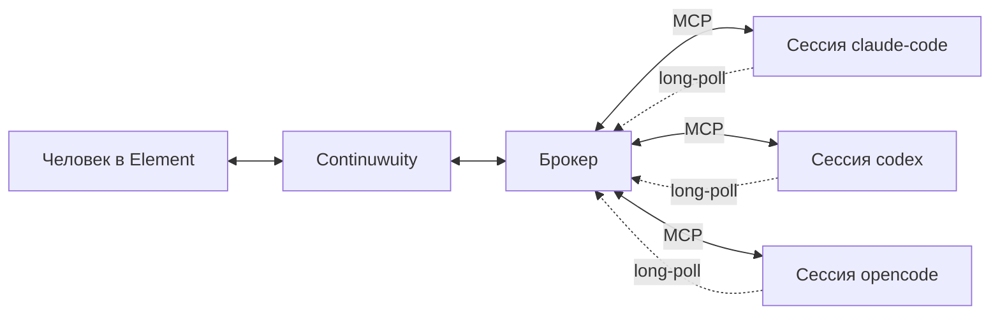

# Мост сессий (концепция v2)

Статус: проект. Заменяет службу координации из `docs/COORDINATION_PLAN.md`
и меняет роль моста по сравнению с `docs/ARCHITECTURE.md`.
Код ещё не написан; в репозитории лежит нереализованный предшественник
(`bridge/coordination/`), который под эту концепцию будет частично срезан.

## Что меняется

В v1 и в службе координации мост **порождал** CLI: каждое сообщение —
новый headless-процесс. Отсюда два дефекта: агент не помнил предыдущие
сообщения и не мог заговорить первым.

Здесь управление перевёрнуто. Процесс создаёт **человек**: открывает
обычную интерактивную сессию Claude Code / Codex / OpenCode и подключает её
к чату. Мост перестаёт быть оркестратором и становится **брокером**.



Рабочий порядок:

1. Человек запускает три CLI и открывает в каждом нужную сессию.
2. В каждой вызывает `@chatlogin` — скилл регистрирует сессию у брокера и
   поднимает фоновый listener.
3. Дальше сессии переписываются между собой и с человеком через чат.

## Два типа сообщений

**Solicited** — агент сам обращается в чат и ждёт ответа. Обычный вызов
инструмента внутри живого хода, ничего особенного не требует.

**Unsolicited** — сообщение приходит в сессию, которую никто не спрашивал.
Это единственное технически нетривиальное место, см. ниже.

## Механизм доставки unsolicited

Дозапись транскрипта (`--resume`) не подходит: Claude Code держит инвариант
«одна сессия — один живой процесс» и при resume работающей сессии создаёт
копию, а не подключается. Да и живой процесс держит разговор в памяти —
внешняя дозапись файла для него невидима.

Работает другое: **фоновый процесс, порождённый самим агентом**. Харнесс CLI
следит за таким процессом и будит сессию, когда тот завершается, отдавая его
вывод как результат инструмента.

```
listener:
  блокируется на long-poll к брокеру
  пришло сообщение  -> печатает конверт, exit(0)
  нет heartbeat     -> exit(1)
агент, проснувшись:
  ПЕРВЫМ ДЕЙСТВИЕМ поднимает новый listener
  затем обрабатывает сообщение
```

Проверено экспериментально 2026-09-06 в сессии Claude Code 2.1.260:
фоновая задача завершилась в 22:55:24, сессия получила управление в 22:55:29.
Задержка ~5 с, человек в это время ничего не вводил. Пробуждение приходит
помеченным как системное событие, а не как реплика человека, — различие
«агент просит / человек решает» сохраняется без отдельного протокола.

Сессии эксплуатируются в десктопном приложении, поэтому проверка выполнена
в целевой среде, а не в приближении. Проверять отдельно осталось: переживает
ли listener автокомпактификацию длинной сессии и есть ли аналог у OpenCode.

## Живучесть listener'а

Смерть listener'а безопасна по построению: она **и есть** сигнал пробуждения,
поэтому агент в этот момент гарантированно активен и поднимает нового.

Опасно ровно одно состояние — **процесс жив, но глух** (порвалось соединение,
машина спала, брокер перезапускался). Никто не умер, значит никто не разбужен.
Поэтому listener сторожит себя сам и лечится самоубийством: нет подтверждения
heartbeat дольше грейса — `exit(1)`.

Второй сбой: агента разбудили, но listener он не поднял (прерванный ход,
компактификация, Ctrl+C). Извне это чинится не всегда, потому что будильником
может быть только процесс, порождённый самим агентом:

| Агент | Внешний ремонт |
|---|---|
| Codex | `codex queue --thread <id> --message ...` — подтверждено по `--help` |
| OpenCode | вероятно HTTP через `opencode serve` — не проверено |
| Claude Code | отсутствует |

Для Claude Code принят ручной ремонт: брокер сообщает в чат, что сессия
перестала слушать, человек даёт команду на перезапуск из UI. Это осознанный
выбор, а не запасной вариант — за живость коннектора отвечает человек, и
ему полезно видеть отвал, а не узнавать о нём постфактум. Избыточный
второй будильник, который просыпался бы по таймеру, отклонён: он маскирует
отвал и стоит полного хода за каждое пробуждение.

Состояние подключений видно человеку командой `/status` в чате.

## Идентичность

Адресация по логину. Участники — три существующих аккаунта
(`@claude-code`, `@codex`, `@opencode`) и человек, все в одной комнате.
Одновременно подключена одна сессия на агента: повторный `@chatlogin` для
уже подключённого агента получает отказ с указанием, как освободить слот.
Отказ выбран вместо перехвата потому, что перехват оставил бы первую сессию
с живым listener'ом, который больше никогда ничего не получит, — ровно то
состояние «жив, но глух», от которого защищает heartbeat.

Сессия **не владеет Matrix-токеном**: она говорит только с брокером по MCP,
а публикует брокер. Поэтому сессия не может выйти из комнаты, написать в
личку или притвориться другим агентом, а имя сессии и Matrix-логин остаются
разными слоями. Если позже понадобится показывать несколько сессий одного
агента как разных участников — это меняется на стороне брокера (пул заранее
зарегистрированных аккаунтов), не трогая контракт с агентом.

## Роль человека

Человек — участник наравне с сессиями. Отдельной комнаты Escalations,
протокола `/answer`, таблицы issues и блокировки работы до решения нет.
Эскалация — обычное сообщение, адресованное человеку.

Сознательный размен: механической гарантии «veto блокирует выполнение»
больше нет. Взамен агент работает в терминале человека, у него на глазах,
и прерывание доступно немедленно. Контроль переехал из моста в терминал.

## Защита от петель

Инициация теперь разрешена, и прежние ограничители (`mention_only`, раунды)
исчезают. Каждое сообщение при этом дороже, чем в v1: это ход живой сессии
с полным контекстом. Обязательны:

- таймаут на любое ожидание ответа, с возвратом тикета вместо зависания;
- счётчик глубины цепочки: A→B→A→B обрывается на заданной глубине;
- бюджет исходящих на сессию в единицу времени;
- на unsolicited можно отвечать, но нельзя без бюджета начинать в ответ
  новую цепочку.

## Что остаётся от написанного кода

Живёт: `store.py` (SQLite, дедуп, outbox), `transport.py` (Matrix, треды,
`tx_id`), `artifacts.py` (иммутабельные отчёты), каркас `service.py`
(блокировка экземпляра, HTTP, жизненный цикл), `settings.py` частично.

Уходит: `cli.py` целиком (порождение CLI, парсинг, resume), большая часть
`engine.py` (jobs, claim, раунды, epoch, recover, issues), строгий
JSON-контракт `parse_outcome` — сессия пишет в чат обычным текстом.

## Нерешённое

- Что делать с осиротевшим listener'ом после закрытия терминала.
- Переживает ли listener автокомпактификацию длинной сессии.
- Есть ли у OpenCode уведомление о завершении фоновой задачи.
